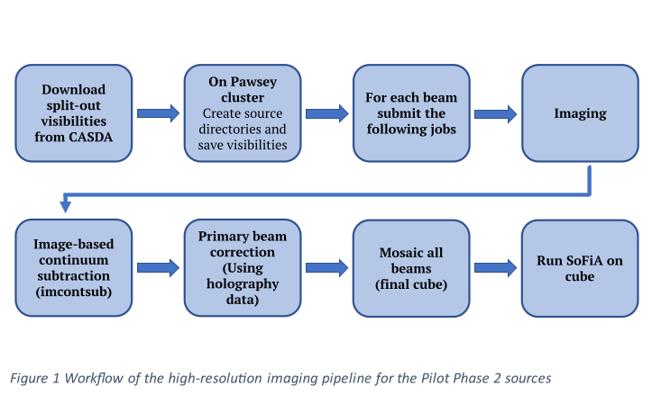

# wallaby-hires

## WALLABY hires pipeline implemented as a DALiuGE workflow
- The existing test WALLABY hires pipeline was a simple, manually invoked script that was not under version control. It mostly produced configuration files for ASKAPsoft and SLURM. 
- The new pipeline is implemented as a DALiuGE workflow, which is kept under version control on GitHub along with the required additional software components. The workflow and the individual components are configurable using the DALiuGE EAGLE graphical workflow editor, and individual workflow instances (sessions) can be submitted to multiple processing platforms, including a local laptop, the ICRAR Hyades cluster and Setonix.
- The workflow includes components to download the required data from CASDA, prepare the ASKAP configuration files (parameter files), launch the imager, continuum subtraction and primary beam correction for each of the beams and footprints and then run the final mosaicing to combine the individual image cubes into a single output cube and the associated weight cube and upload those to Acacia.
- The final upload location of the data products can be configured, depending on operational needs.
- The main ASKAPsoft components are launched as Docker or Singularity containers, which are provided by the ASKAP software team or Pawsey.
- In operations, this workflow will be controlled by another long-running workflow, which will poll CASDA for new observations in a configurable cadence (maybe once a day) and trigger the main imaging workflow once new data becomes available. 

## Original pipeline

