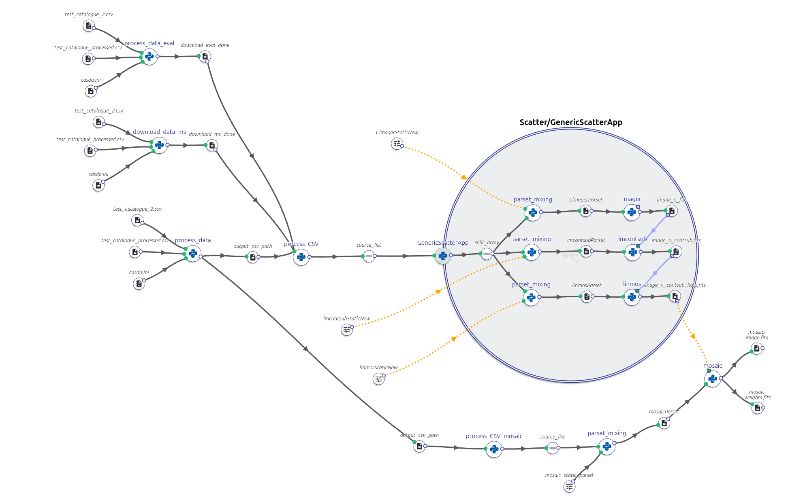

# wallaby-hires

## WALLABY "hi-res" imaging pipeline implemented as a DALiuGE graph
- The existing test [WALLABY](https://wallaby-survey.org/) hires pipeline was a simple, manually invoked script that was not under version control. It mostly produced configuration files for [ASKAPsoft](https://www.atnf.csiro.au/computing/software/askapsoft/sdp/docs/current/pipelines/introduction.html) and SLURM. 
- The new pipeline is implemented as a [DALiuGE](https://daliuge.readthedocs.io/en/latest/) workflow, which is kept under version control on GitHub along with the required additional software components.
- The workflow and the individual components are configurable using the [EAGLE](https://eagle-dlg.readthedocs.io/en/master/installation.html#) graphical workflow editor, and individual workflow instances (sessions) can be submitted to multiple processing platforms, including a local laptop, the ICRAR Hyades cluster and on the [Setonix](https://pawsey.org.au/systems/setonix/) supercomputer at Pawsey. 
- The workflow includes components to download the required data from [CASDA](https://research.csiro.au/casda/), prepare the ASKAPsoft configuration files (parameter files), launch the imager, continuum subtraction and primary beam correction for each of the beams of the footprints and then run the final mosaicing to combine the individual image cubes into a single output cube and the associated weight cube and upload those to Acacia.
- The final upload location of the data products can be configured, depending on operational needs.
- The main ASKAPsoft components ([imager](https://www.atnf.csiro.au/computing/software/askapsoft/sdp/docs/current/calim/imager.html), [imcontsub](https://www.atnf.csiro.au/computing/software/askapsoft/sdp/docs/current/calim/imcontsub.html) & [linmos](https://www.atnf.csiro.au/computing/software/askapsoft/sdp/docs/current/calim/linmos.html)) are launched as Docker or Singularity containers, which are provided by the ASKAP software team or Pawsey.
- In operations, this workflow will be controlled by another long-running workflow, which will poll CASDA for new observations in a configurable cadence (maybe once a day) and trigger the main imaging workflow once new data becomes available.
- Here, two versions of the graph are implemented: test and deployment versions. Both versions were tested and benchmarked on the ICRAR Hyades cluster and on Setonix. 

### Test and Deployment versions of the DAliuGE graph
- The only difference between the test and deployment versions of the graph is that, in the test version, the imager, imcontsub, linmos, and mosaicking components are replaced with Python functions: imager(), imcontsub(), linmos(), and mosaic().
- In the deployment version of the graph, imager, imcontsub, linmos, and mosaicking as ASKAPsoft components executed within a Docker container using the icrar/yanda_imager:0.4 image.

### Current workflow of the pipeline implemented as a DALiuGE graph
Inputs: 
1. Catalogue: Path to the CSV file containing HIPASS sources to be processed.
2. Processed catalogue: Path to the CSV file with names of already processed sources.
3. Credentials: Path to the CASDA credentials file. 
Processing steps:
1. Processes the input source catalogue: Checks for existing sources, identifies unprocessed sources, retrieves relevant data (RA, DEC, and Vsys), stages files for download, and saves the processed data in a specified CSV format containing the information: source name, RA, DEC, Vsys and evaluation_file_path. 
2. Reads the CSV file: Returns a list of dictionaries from the processed file that contain the dynamic parsets corresponding to all the beams of the given HIPASS source.
3. Combines parameter sets: Merges the static and dynamic parameter sets for all beams of each HIPASS source.
4. Inputs for imaging stages: The complete parameter sets are supplied as inputs to the ASKAPsoft components: imager, imcontsub, and linmos.These components are launched inside Docker or Singularity containers on Hyades and Setonix, respectively. 
6. Final step - mosaicking: When all the beams are processed, mosaicking is performed using the output files from the linmos stage. 

### Logical graph
#### For each HIPASS source, the following three processes run in parallel:
- Downloading the measurement set (.ms) files required for the imager.
- Downloading the evaluation files needed for linmos.
- Querying the input HIPASS source to retrieve relevant data, which is then stored in a CSV file. This file includes details such as the source name, RA, DEC, Vsys, evaluation file, and evaluation file path. The CSV file is then passed as input to the function read_and_process_csv, which generates the dynamic components of the parset files.


 - Link to the test graph: [wallaby-hires-test-pipeline.graph](https://eagle.icrar.org/?service=GitHub&repository=ICRAR/wallaby-hires&branch=main&path=dlg-graphs&filename=wallaby-hires_test-pipeline.graph)

## Installation
There are multiple options for the installation, depending on how you intend to run the DALiuGE engine, directly in a virtual environment (host) or inside a docker container. You can also install it either from PyPI (the latest released version).

## Install it from PyPI

### Engine in a virtual environment
```bash
pip install wallaby_hires
```
This will only work after releasing the project to PyPi.
### Engine in Docker container
```bash
docker exec -t daliuge-engine bash -c 'pip install --prefix=$DLG_ROOT/code wallaby_hires'
```

